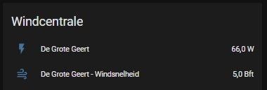

# Windcentrale

## Prerequisites
To configure a windmill from the WindCentrale in HA, you needs to know, the id from the windmill and the number of windshares you own.
The id can be found in the following table:

| Name              |   ID | ParkID | # Winddelen |
| :---              | ---: |   ---: |        ---: |
| De Grote Geert    |    1 |      1 |        9910 |
| De Jonge Held     |    2 |      1 |       10154 |
| Het Rode Hert     |   31 |     11 |        6648 |
| De Ranke Zwaan    |   41 |     11 |        6164 |
| De Witte Juffer   |   51 |     11 |        5721 |
| De Bonte Hen      |  111 |     21 |        5579 |
| De Trouwe Wachter |  121 |     21 |        5602 |
| De Blauwe Reiger  |  131 |     21 |        5534 |
| De Vier Winden    |  141 |     21 |        5512 |
| De Boerenzwaluw   |  191 |     31 |        3000 |
| Het Vliegend Hert |  211 |     51 |        9751 |

## Configuration
Be sure that the `sensor: !include sensor.yaml` entry is specified in the `configuration.yaml`

Use `sensor.yaml` to setup the entities for HA

```
- platform: rest
  name: De Grote Geert
  device_class: power
  scan_interval: 60
  resource: https://zep-api.windcentrale.nl/production/xxx/live # for .../xxx/... replace the 'xxx' for the id of your windmill
  json_attributes:
    - windSpeed
    - windDirection
    - powerAbsTot
    - powerAbsWd
    - powerRel
    - diameter
    - rpm
    - pulsating
    - hoursRunThisYear
    - runPercentage
  value_template: "{{ value_json.powerAbsWd * yyy }}" # for ... * yyy ... replace the 'yyy' for the number of windshares you own
  unit_of_measurement: "W"
- platform: template
  sensors:
    de_grote_geert_speed:
      friendly_name: "De Grote Geert - Windsnelheid"
      value_template: '{{ states.sensor.de_grote_geert.attributes["windSpeed"] }}'
      unit_of_measurement: "Bft"
```
Also change the names for eg. the sensor, friendly_name, etc. in the name of your windmill.

If you have 2 shares from de Grote Geert, you get info like:


