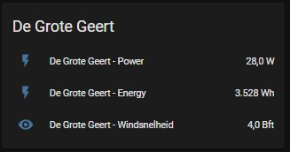

# Windcentrale
If you have shares from [de Windcentrale](//windcentrale.nl), this configuration gives you all kind of information about your windmill.

## Prerequisites
To configure a windmill from the WindCentrale in HA, you needs to know, the id from the windmill and the number of windshares you own.
The id can be found in the following table:

| Name              |   ID | ParkID | # Winddelen |
| :---              | ---: |   ---: |        ---: |
| De Grote Geert    |    1 |      1 |        9910 |
| De Jonge Held     |    2 |      1 |       10154 |
| Het Rode Hert     |   31 |     11 |        6648 |
| De Ranke Zwaan    |   41 |     11 |        6164 |
| De Witte Juffer   |   51 |     11 |        5721 |
| De Bonte Hen      |  111 |     21 |        5579 |
| De Trouwe Wachter |  121 |     21 |        5602 |
| De Blauwe Reiger  |  131 |     21 |        5534 |
| De Vier Winden    |  141 |     21 |        5512 |
| De Boerenzwaluw   |  191 |     31 |        3000 |
| Het Vliegend Hert |  211 |     51 |        9751 |

## Configuration
Be sure that the `sensor: !include sensor.yaml` entry is specified in the `configuration.yaml`

Use [sensor.yaml](sensor.yaml) to setup the entities for HA.

You can use [customize.yaml](customize.yaml) to add nice icons.

Also change the names for eg. the sensor, friendly_name, etc. in the name of your windmill.

## Data
### URL example
https://zep-api.windcentrale.nl/production/1/live

### Output
The json output looks like:
```json
{
  "powerProducerId": "f588ce00-92ee-45ee-b480-f7d6df204034",
  "windSpeed": 3,
  "windDirection": "W",
  "powerAbsTot": 70,
  "powerAbsWd": 8,
  "powerRel": 3,
  "diameter": 14,
  "rpm": 8.9,
  "pulsating": false,
  "kwh": 2379836,
  "kwhForecast": 4955000,
  "hoursRunThisYear": 4817.4833333333,
  "runPercentage": 94.52746398166339,
  "windSpeedForecast": 3,
  "windDirectionForecast": "W",
  "timestamp": "2018-07-30T21:44:55"
}
```

## Screenshots
If you have 2 shares from de Grote Geert, you get info like:




## Support
[By me a 🍺](https://www.buymeacoffee.com/xorfor)
